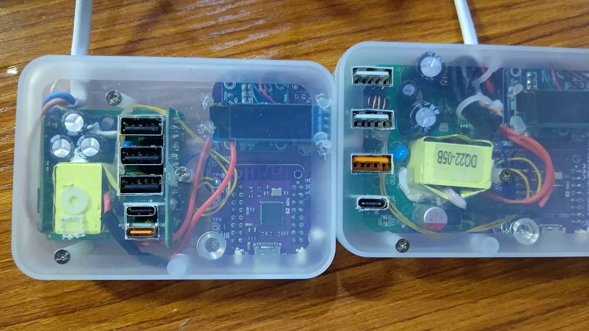

# USB Charger DIY (USB 充电器 DIY)

[中文说明](#chinese)

USB charger DIY, using fast charging module, detects charging voltage, current, power, temperature, capacity etc. Programming with micropython.

## 说明

**USB 充电器 DIY**，使用网络上低成本的快充模块，加上MCU和传感器，实现电压、电流、功率、温度等参数采集，可以监测充电状态，统计充电容量等功能。

本项目是为了提供一个可以参考的原型，大家可以在此基础上，增加或删除功能，按照自己想法DIY出更多有趣的制作。

PCB设计使用了立创EDA软件，单片机程序使用 micropython 开发。

**因为存在220V高压，DIY时请注意安全。**

## 主要器件

为了简化DIY的复杂度，尽量使用了模块，其它元件数量也尽可能少。

- **快充模块**。型号众多，成本较低，18W的居多（5V3.4A、9V2A、12V1.5A），可以根据需要选择。因为快充模块质量参差不齐，采购时尽量选择评价较高的，使用前需要多测试（注意安全），确认没有问题后在使用。
- **MCU**：ESP32S2 mini开发板（可以使用其它型号）。使用ESP32S2，一个是支持micropython；其次因为性价比高，还支持网络，缺点是不支持蓝牙。
- **电流传感器**：INA219模块。第一版时使用了霍尔型的ACS712电流传感器，第二版改为INA219。
- **温度传感器**：MF58热敏电阻（3950，10K）。监测充电过程中内部温度，在温度过高时可以提示。
- **OLED**：128x32，I2接口。
- **电源**：DC/5V模块。用于将快充模块的输出电压转换为5V。部分快充模块输出是高压，部分会动态调整输出电压，因此需要使用一个单独的DC5V模块。如果快充模块带有单独的USB 5V输出口（非快充口），则可以省略此模块。
- **蜂鸣器**：无源蜂鸣器（注意不要使用有源蜂鸣器）。用于发出提示声音。
- **光敏电阻**（可选），用于采集环境光线亮度，用于动态调整LED输出亮度，避免晚上时LED太亮刺眼。
- **LED**：三色共阳LED，用于指示充电状态。第一版时使用了WS2812B。原理图中此处存在一个bug，不应该将电阻连接到公共阳极端，而是每个LED的负极单独串联一个电阻，这样三个LED就互不影响（因为各LED的导通电压不同）。

## 制作步骤

- 首先选择需要的器件、外壳、辅助材料等
- 

## 系统框图

## 原理图

## 相关链接

- 项目网址：
    - [github](https://github.com/shaoziyang/USBChargerDIY)
    - [gitee](https://gitee.com/shaoziyang/usb-charger-diy)
- [EEWorld活动贴](https://bbs.eeworld.com.cn/search.php?mod=forum&api=yes&searchsubmit=yes&kw=%A1%BEUSB%B3%E4%B5%E7%C6%F7DIY%A1%BF)
- [立创EDA设计文件](https://oshwhub.com/shao.ziyang/USB_Charge_DIY_V2)
- [物料选型表【腾讯文档】](https://docs.qq.com/sheet/DZXRCeWhxc0VWbFZu)
- [micropython](https://micropython.org)
