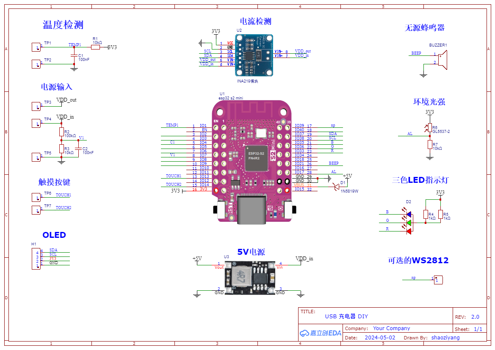

# USB Charger DIY (USB 充电器 DIY)

USB charger DIY, using fast charging module, detects charging voltage, current, power, temperature, capacity etc. Programming with micropython.

## 说明

**USB 充电器 DIY**，使用网络上低成本的快充模块，加上MCU和传感器，实现电压、电流、功率、温度等参数采集，可以监测充电状态，统计充电容量等功能。

本项目是为了提供一个可以参考的原型，大家可以在此基础上，增加或删除功能，DIY出更多有趣的制作。

PCB设计使用了立创EDA软件，单片机程序使用 micropython 开发。

## 主要器件

为了简化DIY的复杂度，尽量使用了模块，其它元件数量也尽可能少。

- MCU：ESP32S2 mini开发板（可以使用其它型号）。使用ESP32S2，一个是支持micropython；其次因为性价比高，还支持网络，缺点是不支持蓝牙。
- 电流传感器：INA219模块。第一版时使用了霍尔型的ACS712电流传感器，第二版改为INA219。
- 温度传感器：MF58热敏电阻（3950，10K）。
- OLED：128x32，I2接口。

## 原理图

## 相关链接

- [EEWorld活动贴](https://bbs.eeworld.com.cn/search.php?mod=forum&api=yes&searchsubmit=yes&kw=%A1%BEUSB%B3%E4%B5%E7%C6%F7DIY%A1%BF)
- [立创EDA设计文件](https://oshwhub.com/shao.ziyang/USB_Charge_DIY_V2)
- [物料选项表【腾讯文档】](https://docs.qq.com/sheet/DZXRCeWhxc0VWbFZu)
- [micropython](https://micropython.org)
